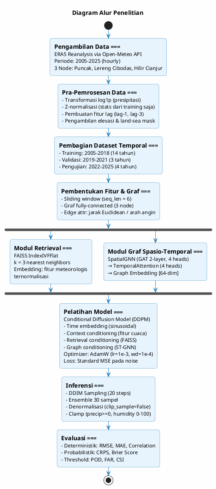
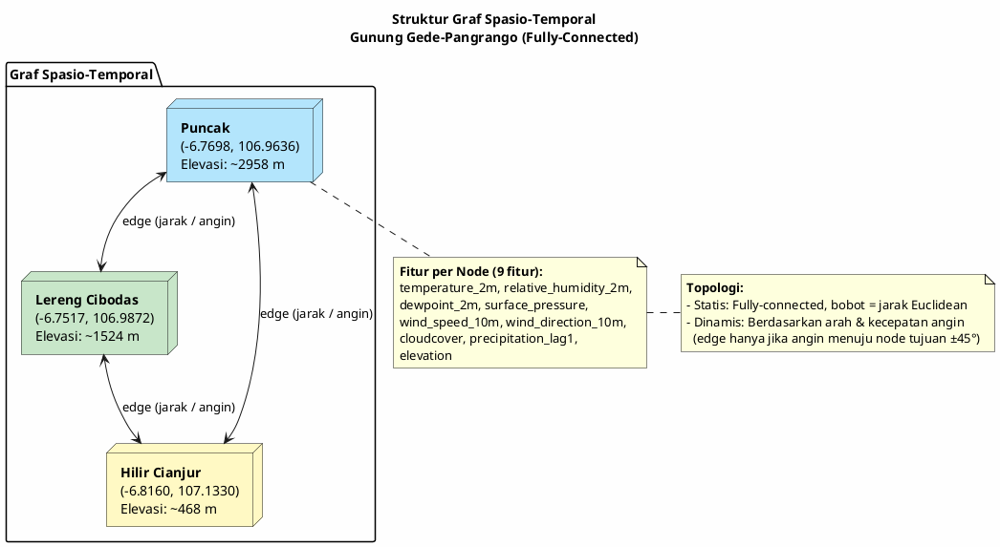
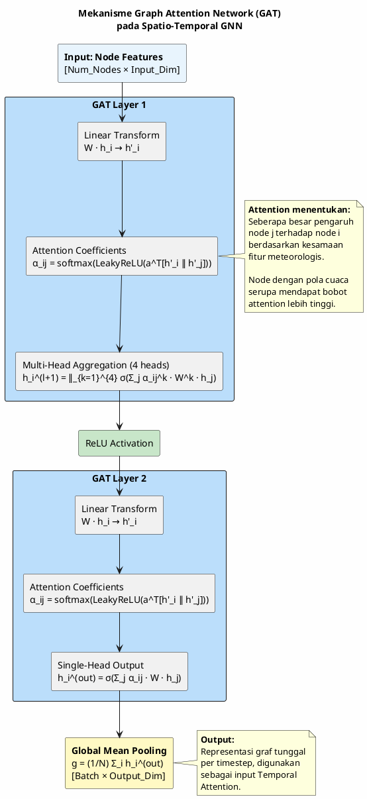
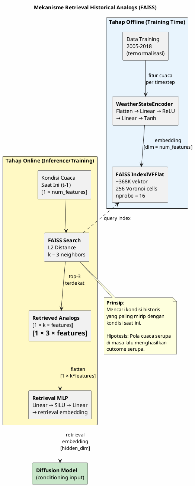
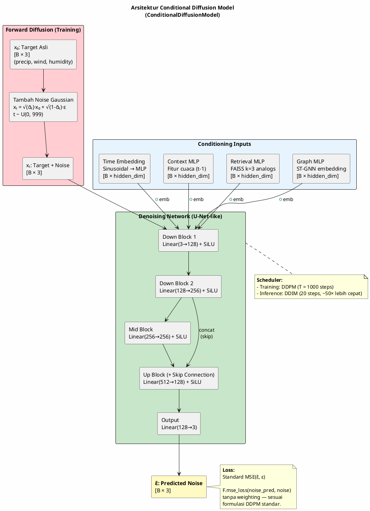
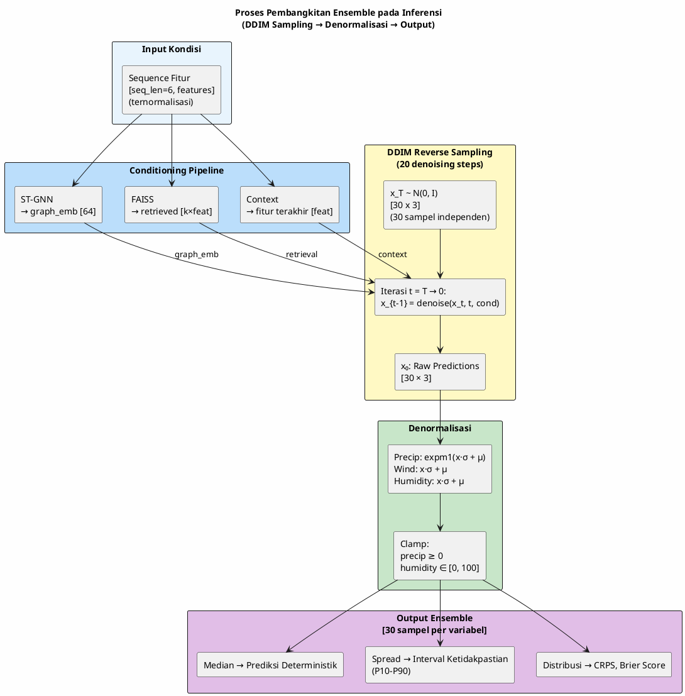
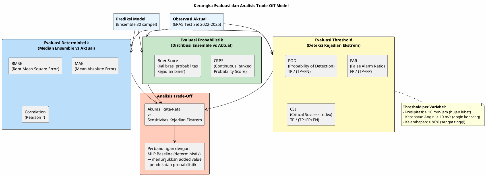

# Diagram dan Tabel Skripsi
## Retrieval-Augmented Diffusion Model dengan Spatio-Temporal Graph Conditioning
### Nowcasting Probabilistik Cuaca Multi-Variabel Gunung Gede-Pangrango

---

## DAFTAR DIAGRAM

---

### Diagram 1 — Alur Penelitian



---

### Diagram 2 — Skema Pembagian Dataset Temporal

```plantuml
@startuml
skinparam backgroundColor #FEFEFE
skinparam shadowing false
skinparam defaultFontName Arial

title Skema Pembagian Dataset Temporal\n(Strict Temporal Split — Mencegah Kebocoran Informasi)

scale 1 as 60 pixels

concise "Dataset" as D

@D
0 is {-}

@2005
D is "Training (14 tahun)\n~67% data" #90CAF9

@2019
D is "Validasi (3 tahun)\n~14% data" #FFF59D

@2022
D is "Pengujian (4 tahun)\n~19% data" #EF9A9A

@2026
D is {-}

@D
2005 <-> 2019 : 2005-01-01 s/d 2018-12-31
2019 <-> 2022 : 2019-01-01 s/d 2021-12-31
2022 <-> 2026 : 2022-01-01 s/d 2025-12-31

@enduml
```

**Keterangan:**
- **Training (2005–2018):** Digunakan untuk melatih model dan menghitung statistik normalisasi. Data retrieval FAISS juga hanya berasal dari periode ini.
- **Validasi (2019–2021):** Digunakan untuk early stopping dan tuning hyperparameter. Dinormalisasi dengan statistik dari data training.
- **Pengujian (2022–2025):** Evaluasi performa final. Tidak pernah dilihat selama proses pelatihan.
- **Tidak ada random shuffle** — pembagian berdasarkan waktu untuk menghindari kebocoran informasi temporal.

---

### Diagram 3 — Struktur Graf Spasio-Temporal Antar Node



---

### Diagram 4 — Mekanisme Graph Attention Network (GAT)



---

### Diagram 5 — Mekanisme Retrieval Historical Analogs



---

### Diagram 6 — Arsitektur Conditional Diffusion Model



---

### Diagram 7 — Proses Pembangkitan Ensemble pada Tahap Inferensi



---

### Diagram 8 — Kerangka Evaluasi dan Analisis Trade-Off Model



---

## DAFTAR TABEL

---

### Tabel 1 — Lokasi Node Penelitian

| No | Nama Node | Latitude | Longitude | Elevasi (m) | Karakteristik |
|----|-----------|----------|-----------|-------------|---------------|
| 1 | Puncak | -6.769797 | 106.963583 | ~2958 | Zona puncak gunung, elevasi tertinggi |
| 2 | Lereng Cibodas | -6.751722 | 106.987160 | ~1524 | Zona lereng tengah, kawasan hutan |
| 3 | Hilir Cianjur | -6.816000 | 107.133000 | ~468 | Zona dataran rendah, hilir |

**Catatan:** Koordinat didefinisikan dalam `src/data/ingest.py`. Elevasi diperoleh melalui Open-Meteo Elevation API. Ketiga node membentuk graf fully-connected untuk memodelkan interaksi spasial antar zona ketinggian.

---

### Tabel 2 — Variabel Meteorologis yang Digunakan

| No | Variabel | Satuan | Sumber | Tipe |
|----|----------|--------|--------|------|
| 1 | `precipitation` | mm/jam | ERA5 Reanalysis | Dinamis |
| 2 | `temperature_2m` | °C | ERA5 Reanalysis | Dinamis |
| 3 | `relative_humidity_2m` | % | ERA5 Reanalysis | Dinamis |
| 4 | `dewpoint_2m` | °C | ERA5 Reanalysis | Dinamis |
| 5 | `surface_pressure` | hPa | ERA5 Reanalysis | Dinamis |
| 6 | `wind_speed_10m` | m/s | ERA5 Reanalysis | Dinamis |
| 7 | `wind_direction_10m` | ° (derajat) | ERA5 Reanalysis | Dinamis |
| 8 | `cloudcover` | % | ERA5 Reanalysis | Dinamis |
| 9 | `elevation` | m | Open-Meteo Elevation API | Statis |
| 10 | `land_sea_mask` | biner (0/1) | Turunan dari elevasi | Statis |
| 11 | `precipitation_lag1` | mm/jam | Lag-1 dari presipitasi | Autoregresif |
| 12 | `precipitation_lag3` | mm/jam | Lag-3 dari presipitasi | Autoregresif |

**Catatan:** Data diambil melalui Open-Meteo Archive API untuk periode 2005–2025 dengan resolusi temporal per jam. Variabel lag dihitung per node setelah pengambilan data.

---

### Tabel 3 — Fitur Input dan Variabel Target Model

| Kategori | Variabel | Keterangan |
|----------|----------|------------|
| **Fitur Input (Conditioning)** | `temperature_2m` | Suhu udara 2m |
| | `relative_humidity_2m` | Kelembapan relatif 2m |
| | `dewpoint_2m` | Titik embun (humidity proxy) |
| | `surface_pressure` | Tekanan permukaan |
| | `wind_speed_10m` | Kecepatan angin 10m |
| | `wind_direction_10m` | Arah angin 10m |
| | `cloudcover` | Tutupan awan (convective proxy) |
| | `precipitation_lag1` | Presipitasi 1 jam sebelumnya |
| | `elevation` | Ketinggian node (statis) |
| **Variabel Target** | `precipitation` | Presipitasi (mm/jam) |
| | `wind_speed_10m` | Kecepatan angin (m/s) |
| | `relative_humidity_2m` | Kelembapan relatif (%) |

**Catatan:** Model memprediksi 3 variabel target secara simultan (multi-output). `temperature_2m` awalnya dipertimbangkan sebagai target namun dikeluarkan (excluded) dalam implementasi final.

---

### Tabel 4 — Konfigurasi Pra-pemrosesan Data

| Langkah | Variabel | Metode | Detail |
|---------|----------|--------|--------|
| Transformasi | `precipitation` | Log1p | $x' = \log(1 + x)$ — mengurangi skewness distribusi presipitasi |
| Transformasi | `wind_speed_10m` | Tidak ada | Nilai asli digunakan langsung |
| Transformasi | `relative_humidity_2m` | Tidak ada | Nilai asli digunakan langsung |
| Normalisasi Target | `precipitation` | Z-score standar | $z = \frac{x' - \mu}{\sigma}$ — tanpa multiplier, target range N(0,1) |
| Normalisasi Target | `wind_speed_10m`, `relative_humidity_2m` | Z-score standar | $z = \frac{x - \mu}{\sigma}$ |
| Normalisasi Fitur | Semua fitur input | Z-score standar | $z = \frac{x - \mu_c}{\sigma_c + 10^{-5}}$ |
| Lag Features | `precipitation_lag1` | Shift(1) per node | Presipitasi 1 jam sebelumnya, NaN diisi 0 |
| Lag Features | `precipitation_lag3` | Shift(3) per node | Presipitasi 3 jam sebelumnya, NaN diisi 0 |

**PENTING:** Statistik normalisasi ($\mu$, $\sigma$) dihitung **hanya dari data training (2005–2018)** untuk mencegah kebocoran informasi. Data validasi dan test dinormalisasi dengan statistik yang sama.

---

### Tabel 5 — Konfigurasi Arsitektur Model

| Komponen | Parameter | Nilai |
|----------|-----------|-------|
| **Spatio-Temporal GNN** | | |
| └ SpatialGNN (GAT) | Jumlah layer | 2 |
| | Attention heads (Layer 1) | 4 (concat) |
| | Attention heads (Layer 2) | 1 |
| | Input dim | num_features (9) |
| | Hidden dim | 64 |
| | Output dim | 64 |
| | Dropout | 0.1 |
| └ TemporalAttention | Mekanisme | Multi-Head Self-Attention |
| | Attention heads | 4 |
| | Dropout | 0.1 |
| | Agregasi | Mean over sequence |
| └ Output Projection | Dimensi output (graph_dim) | 64 |
| **Conditional Diffusion Model** | | |
| | Input dim (num_targets) | 3 |
| | Context dim | num_features (9) |
| | Retrieval dim | num_features × k = 9 × 3 = 27 |
| | Graph dim | 64 |
| | Hidden dim | 128 |
| | Time embedding | Sinusoidal positional |
| | Arsitektur backbone | U-Net-like (down→mid→up + skip) |
| | Aktivasi | SiLU (backbone), GELU (time MLP) |
| **Diffusion Scheduler** | | |
| | Training scheduler | DDPM |
| | Timesteps (T) | 1000 |
| | Inference scheduler | DDIM |
| | Inference steps | 20 |
| **Retrieval Module** | | |
| | Indeks FAISS | IndexIVFFlat (L2 distance) |
| | Voronoi cells (nlist) | 256 |
| | Search probe (nprobe) | 16 |
| | k neighbors | 3 |

---

### Tabel 6 — Hyperparameter Pelatihan Model

| Parameter | Nilai | Keterangan |
|-----------|-------|------------|
| Optimizer | AdamW | Dengan weight decay |
| Learning rate | 1 × 10⁻³ | Untuk seluruh parameter (GNN + Diffusion) |
| Weight decay | 1 × 10⁻⁴ | Regularisasi L2 |
| Batch size | 512 | Dioptimalkan untuk RTX 3050 4GB VRAM |
| Epochs (Diffusion) | 20 | Dengan validasi per epoch |
| Epochs (MLP) | 51 | Early stopped (patience=10) |
| Sequence length | 6 | 6 timestep per sliding window |
| Mixed precision | AMP (FP16) | Otomatis jika GPU tersedia |
| Gradient scaling | GradScaler | Untuk stabilitas AMP |
| Loss function | Standard MSE | `F.mse_loss(noise_pred, noise)` — DDPM standar |
| Scheduler (MLP) | CosineAnnealingLR | Untuk MLP baseline |
| Early stopping (MLP) | patience=10 | + best checkpoint selection |
| Best val_loss (Diff) | 0.1210 | Checkpoint terbaik disimpan |

---

### Tabel 7 — Metrik Evaluasi Model

| Kategori | Metrik | Formula | Tujuan |
|----------|--------|---------|--------|
| **Deterministik** | RMSE | $\sqrt{\frac{1}{N}\sum_{i=1}^{N}(\hat{y}_i - y_i)^2}$ | Mengukur rata-rata besarnya kesalahan prediksi; sensitif terhadap outlier |
| | MAE | $\frac{1}{N}\sum_{i=1}^{N}\|\hat{y}_i - y_i\|$ | Mengukur rata-rata kesalahan absolut; lebih robust terhadap outlier |
| | Correlation | $r = \frac{\text{cov}(\hat{y}, y)}{\sigma_{\hat{y}} \cdot \sigma_y}$ | Mengukur kekuatan hubungan linear antara prediksi dan observasi |
| **Probabilistik** | CRPS | $\text{CRPS} = E\|X - y\| - \frac{1}{2}E\|X - X'\|$ | Mengukur kualitas distribusi prediksi; semakin rendah semakin baik |
| | Brier Score | $BS = \frac{1}{N}\sum_{i=1}^{N}(p_i - o_i)^2$ | Mengukur kalibrasi probabilitas untuk kejadian biner (hujan/tidak hujan di atas threshold) |
| **Threshold** | POD | $\frac{TP}{TP + FN}$ | Proporsi kejadian ekstrem yang berhasil terdeteksi oleh model |
| | FAR | $\frac{FP}{TP + FP}$ | Proporsi alarm palsu dari seluruh prediksi positif model |
| | CSI | $\frac{TP}{TP + FP + FN}$ | Indeks gabungan yang mempertimbangkan hit, miss, dan false alarm |

**Keterangan:**
- $\hat{y}$: prediksi (median ensemble untuk metrik deterministik)
- $y$: observasi aktual
- $X, X'$: sampel independen dari distribusi ensemble
- $p_i$: probabilitas prediksi (fraksi ensemble yang melampaui threshold)
- $o_i$: observasi biner (1 jika melampaui threshold, 0 jika tidak)
- TP: True Positive, FP: False Positive, FN: False Negative

---

### Tabel 8 — Ambang Intensitas untuk Evaluasi Threshold

| Variabel | Ambang | Satuan | Kategori | Keterangan |
|----------|--------|--------|----------|------------|
| `precipitation` | > 10.0 | mm/jam | Hujan lebat | Sesuai klasifikasi BMKG untuk intensitas hujan lebat per jam |
| `wind_speed_10m` | > 10.0 | m/s | Angin kencang | Kecepatan angin yang berpotensi berbahaya bagi pendaki |
| `relative_humidity_2m` | > 90.0 | % | Kelembapan sangat tinggi | Indikator potensi kabut tebal dan visibilitas rendah |

**Catatan:**
- Ambang digunakan untuk menghitung metrik threshold: POD, FAR, CSI, dan Brier Score
- Brier Score menggunakan probabilitas ensemble: $p = \frac{\text{jumlah sampel} > \text{threshold}}{\text{total sampel ensemble}}$
- Evaluasi threshold penting untuk konteks keselamatan pendaki di Gunung Gede-Pangrango — deteksi kejadian ekstrem lebih kritis daripada akurasi rata-rata

---
